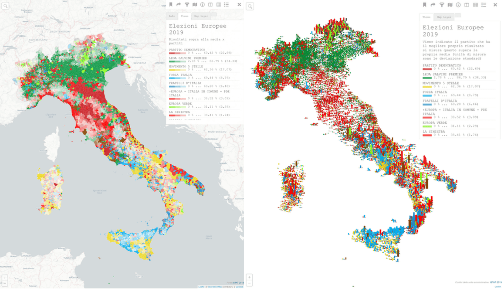

- [Creare in pochi minuti una mappa elettorale a partire dai dati del ministero dell'Interno](#Creare-in-pochi-minuti-una-mappa-elettorale-a-partire-dai-dati-del-ministero-dellInterno)
  - [I dati](#I-dati)
- [Fuzzy sti c...y (con zeta dolce)](#Fuzzy-sti-cy-con-zeta-dolce)
- [Creare una procedura](#Creare-una-procedura)
- [CSV Match](#CSV-Match)
- [Il lavoro di Günter](#Il-lavoro-di-G%C3%BCnter)
- [Conclusioni](#Conclusioni)

# Creare in pochi minuti una mappa elettorale a partire dai dati del ministero dell'Interno

Qualche giorno fa mi ha scritto Gunter Richter - anzi lo scrivo bene **Günter** Richter, perché **gli accenti sono importanti** - per chiedermi se quest'anno onData avesse fatto qualcosa con i **dati elettorali** delle elezioni **europee** del 26 maggio **2019**.<br>Lo chiede perché diverse volte abbiamo fatto dei lavori di *scraping*, pulizia e normalizzazione sui dati elettorali ([quello sulle politiche del 2018](https://github.com/ondata/elezionipolitiche2018#sitografia) è stato fonte ci circa 15 pubblicazioni); questa volta purtroppo non abbiamo lavorato su questi dati.

Nella vita precedente facevo più mappe e visto che stavolta non era necessario fare lo *scraping* ([i dati aperti sono pubblicati](https://twitter.com/Viminale/status/1135550843841916928)) e che Günter mi aveva raccontato di avere fatto delle belle mappe, ho deciso di farla anche io una "mappetta".<br>Uso questo termine perché volevo fare **una cosa carina** di base (il partito più votato per ogni comune), in **pochi minuti**.

E confermo che **per fare la mappa, ci vuole poco tempo**. A seguire le modalità per farlo.

## I dati

Il primo passo è stato quello di scaricare il file ["Europee 2019. Scrutini Area Italia"](https://dait.interno.gov.it/documenti/europee2019_scrutini_area_italia.csv) pubblicato su [Eligendo](https://dait.interno.gov.it/elezioni/open-data/dati-elezioni-europee-26-maggio-2019).
<br>Prima di aprirlo ho voluto verificare sul sito quale fosse l'***encoding*** scelto e il **separatore dei campi** del CSV.

---

⚠️ Di *encoding* e separatore non c'è traccia sul sito del Ministero degli Interni.

---

Il separatore si legge guardando le prime righe del file (`I : ITALIA NORD-OCCIDENTALE;LIGURIA;GENOVA;ARENZANO;PARTITO DEMOCRATICO;1904`) e qui è il carattere `;`. <br>Per l'*encoding* ho usato uno dei *tool* con cui si ricava via *inferencing* ([chardet](https://github.com/chardet/chardet)); ho avuto una brutta sorpresa (la prima volta che mi succede), perché lo strumento non è stato in grado di estrarlo. E anche con altri strumenti non riesco a risolvere, perché ho sempre caratteri illegibili, come sotto (avviene ad esempio per tutti i nomi in tedesco del Trentino-Alto Adige, che contengono una dieresi).

    ITALIA NORD-ORIENTALE;TRENTINO-ALTO ADIGE;BOLZANO;LUSON/LۓEN;SVP;506

Allora ho fatto una cosa molto grezza e "a mano": ho aperto il CSV con LibreOffice Calc, e provato uno ad uno i set di caratteri, finché in anteprima mi è comparsa la `Ü` di LÜSEN (e anche di Günter). Perché **gli accenti sono importanti**.


L'*encoding* è il cosidetto [Code page 850](https://www.wikiwand.com/en/Code_page_850). <br>Questa è per me un'altra cosa mai vista, mai incontrato prima questo set di caratteri.

---

⁉️ Quante mappe avrei potuto creare nel tempo che ho impiegato a scoprire quale fosse il set di caratteri ?

---

A questo punto avrei dovuto avere tutto: mi sarebbe bastato scaricare il file geografico con i limiti comunali e fare il *JOIN* con i dati elettorali a partire dal **codice ISTAT** dei vari **comuni**.<br>Ma purtroppo (vedi tabella di esempio di sotto) quest'informazione non è presente.

---

⚠️ Nei dati del Ministero degli interni non c'è alcun riferimento a codici ISTAT.

---

| CIRCOSCRIZIONE | REGIONE | PROVINCIA | COMUNE | LISTA | VOTI_LISTA |
| --- | --- | --- | --- | --- | --- |
| II : ITALIA NORD-ORIENTALE | FRIULI-VENEZIA GIULIA | TRIESTE | SAN DORLIGO DELLA VALLE-DOLINA | LEGA SALVINI PREMIER | 805 |
| II : ITALIA NORD-ORIENTALE | TRENTINO-ALTO ADIGE | BOLZANO | LUSON/LÜSEN | +EUROPA - ITALIA IN COMUNE - PDE ITALIA | 90 |
| IV : ITALIA MERIDIONALE | PUGLIA | LECCE | PRESICCE | FORZA ITALIA | 205 |
| V : ITALIA INSULARE | SICILIA | MESSINA | GIARDINI NAXOS | FORZA ITALIA | 548 |
| V : ITALIA INSULARE | SICILIA | PALERMO | CEFALU' | MOVIMENTO 5 STELLE | 1186 |

Avere il codice ISTAT sarebbe stata la cosa più comoda, ma mi sono detto "Andrea, usa i nomi dei comuni, ma occhio, in Italia ci sono **comuni con lo stesso nome**".
<br>Ho allora scaricato da [ISTAT](https://www.istat.it/it/archivio/6789) i "[Codici statistici delle unità amministrative territoriali: comuni, città metropolitane, province e regioni](https://www.istat.it/storage/codici-unita-amministrative/Elenco-codici-statistici-e-denominazioni-delle-unita-territoriali.zip)" aggiornati al 15 maggio 2019.
<br>Prima di aprirlo ho voluto verificare sul sito di ISTAT quale fosse l'***encoding*** scelto e il **separatore dei campi** del CSV.

---

⚠️ Di *encoding* e separatore non c'è traccia nemmeno sul sito di ISTAT.

---

Ripeto allora quanto fatto sopra sul tema: per fortuna qui l'analisi automatica mi mappa correttamente l'*encoding*, che stavolta è `Windows-1252`.

Allora potevo iniziare con i *JOIN* per nome del Comune e Regione (infatti in una regione non possono esserci comuni con lo stesso nome). Lo faccio e ottengo **ZERO coincidenze**.
<br>Colpa mia, fatto di fretta: **nel file del Ministero degli Interni i nomi dei luoghi sono in "TUTTO MAIUSCOLO" e sul file ISTAT no**. I PC sono scemi e se non istruiti vedono "MILANO" e "Milano" come due città diverse (sono stato un po' scemo anche io).

---

🛎️ I nomi dei luoghi in eligendo sono in "TUTTO MAIUSCOLO"

---

Avere il *case* dei caratteri tutto in maisculo (o in minisculo), alle volte comunque è comodo, perché stringhe come queste hanno delle problematicità che possono provocare altri errori: ad esempio il nome del Comune di "Terranova dei Passerini" non ha tutte le prime lettere in maiuscolo (perché il `dei` va con l'iniziale in minuscolo).<br>
Allora ho riportato tutto in maiscuolo e rifatto il *JOIN*: per **501 comuni però senza esito**.<br>
Allora ho guardato un po' l'*output* e ho visto che ad esempio tutti comuni del Trentino-Alto Adige e della Valle d'Aosta erano assenti e questo avveniva perché nel file ISTAT i nomi delle Regioni sono espressi in tutte le lingue ufficiali di ogni regione (quindi Valle d'Aosta/Vallée d'Aoste e Trentino-Alto Adige/Südtirol).

---

🛎️ I nomi delle regioni in questo file ISTAT sono espressi nelle lingue ufficiali relative.

---

Allora ho estratto i soli nomi in italiano delle regioni e rifatto il tutto. E di nuovo per diversi comuni - circa 140 - non riuscivo a fare la correlazione per nome.

Mi rimanevono fuori ad esempio: AGLIE', ALA' DEI SARDI, ALI', ALI' TERME, ALME', ANTEY-SAINT-ANDRE', ARQUA' PETRARCA, ARQUA' POLESINE, ARSIE', BARZANO', BASCAPE', BASELGA DI PINE', BASICO', BASTIA MONDOVI', BELVI', BIANZE', BIDONI', BUDDUSO', CAGNO', CANICATTI', CANTU', ..."

Il problema sono i **caratteri accentati**.

---

🛎️ Sui dati elettorali del Ministero degli Interni è presente la denominazione trasliletterata dei Comuni (`È` diventa `E'`), nei dati ISTAT no.

---

Ok, a questo punto avrei dovuto terminare ed essere pronto a fare il *JOIN* con soddisfazione, ma non è così, ancora non riesco a ricavare il codice ISTAT di 5 Comuni. Nel dettaglio:

| Nome Ministero Interni | Nome ISTAT | Perché non si riesce a fare il JOIN
| --- | --- | --- |
| PUEGNAGO DEL GARDA | PUEGNAGO SUL GARDA | Sono chiamati diversamente |
| SAN DORLIGO DELLA VALLE-DOLINA | SAN DORLIGO DELLA VALLE | Sono chiamati diversamente |
| ACQUARICA DEL CAPO | PRESICCE-ACQUARICA | È stato unito al Comune di Presicce e rinominato |
| PRESICCE | PRESICCE-ACQUARICA | È stato unito al Comune di Acquarica del Capo e rinominato |
| BORGOCARBONARA | BORGOCARBONARA  | Nel file ISTAT c'è uno spazio dopo la `A` finale |

# Fuzzy sti c...y (con zeta dolce)

Una soluzione sempre possibile nella comparazione di stringhe è usare un confronto *fuzzy*, ovvero sfumato, che mappi la distanza tra parole molto vicine tra loro (perché `Cefalù` ad esempio è quasi `Cefalu'`).

Ho provato a usarla, ma la lingua italiana è ricca e per i Comuni abbiamo ad esempio questi nomi che in un'analisi con algoritmo Levenshtein (uno di quelli usati in questo contesto), sarebbero indistinguibili (non nell'insieme, ma in gruppetti):

| Regione | Nome Comune |
| --- | --- |
| CAMPANIA | CONZA DELLA CAMPANIA |
| CAMPANIA | CONCA DELLA CAMPANIA |
| LOMBARDIA | CORTENUOVA |
| LOMBARDIA | CORTENOVA |
| PIEMONTE | CARTIGNANO |
| PIEMONTE | CARIGNANO |
| PIEMONTE | CERCENASCO |
| PIEMONTE | MERCENASCO |
| PIEMONTE | TAVIGLIANO |
| PIEMONTE | SAVIGLIANO |
| PIEMONTE | SARDIGLIANO |
| PIEMONTE | SANDIGLIANO |

E comparando gli esiti di una modalità più "tradizionale", con una *fuzzy*, qui mi è sembrata più comoda la prima.


# Creare una procedura

**Günter** mi aveva anche detto che, prima di fare le sue mappe, aveva dedicato molto tempo nel mettere in relazione le due anagrafiche. E aveva aggiunto: "**voi come fate**?" In realtà la sua domanda - che è la vera **fonte ispiratrice** di questo post -  è quella di sotto.


Detto che l'obiettivo di base è **associare il codice ISTAT ai nomi dei Comuni usati dal Ministero degli Interni**, un flusso di lavoro potrebbe essere questo:

- scaricare i due dataset (dati elettorali e dati ISTAT con i codici di ogni Comune);
- verifcare di entrambi l'***encoding*** e riportali verso uno comune e più "standard" (come l'UTF-8);
- verifcare di entrambi il ***separatore di campo***, sceglierne uno comune e per comodità usare quello di *default* per la gran parte delle applicazioni, ovvero la `,`;
- estrarre i valori univoci di "Nome Comune in italiano", "Regione", per i dati elettorali, per creare il **file anagrafico** di base di questa risorsa;
- estrarre i valori di "Nome Comune in italiano, "Codice Comunale ISTAT", "Nome Regione in italiano", per i dati ISTAT, per creare il file anagrafico di base di questa risorsa;
- fare il ***JOIN*** per nome di Comune e Regione tra le due anagrafiche create, in modo da associare ai nomi dei Comuni dei dati elettorali il codice ISTAT
  - senza tenere conto del ***case* dei caratteri** (maiuscolo, minuscolo);
  - senza tenere conto di **spazi errati** (doppi spazi da riportare a uno e spazi a inizio/fine cella da rimuovere);
  - senza tenere conto dei **caratteri non alfanumerici** (come `-`, `~`, `.`, ecc.);
  - senza tenere conto dei **caratteri accentati** e riportali secondo l'alfabeto latino;
- **correggere** in modo specifico i **nomi dei Comuni** di cui non è possibile fare il *JOIN*, per errori presenti nei file di origine.

Tutto questo è stato trasformato in [questo script bash](./guenter.sh) in cui la parte "importante", quella della comparazione tra le due anagrafiche di nomi Comuni, è stata fatta con il comodissimo [**CSV Match**](https://github.com/maxharlow/csvmatch).

# CSV Match

**CSV Match** è un'*utility* python per fare *matching* tra CSV, ovvero quello di cui si parla sopra.<br>Per approfondire consiglio [questa ottima presentazione](https://docs.google.com/presentation/d/1oRSrVuRhff9UDO4-zfKsk9VnhnSGeaS1FNguA-SUXR8/edit#slide=id.g52423af19d_0_53) di Max Harlow (il suo autore), preparata per la conferenza NICAR 2019 (le cui slide sono ogni hanno fonte di perle).

Qui qualche nota su come è stata utilizzata in questa occasione. Il comando lanciato è:

```bash
# comando di base con parametri
csvmatch -i -a -n -l "$folder"/risorse/rule.txt \
# CSV da comparare
"$folder"/dati/anagraficaISTAT.csv "$folder"/dati/anagraficaElezioni.csv \
# campi utilizzati per il JOIN nel primo file CSV
--fields1 "Denominazione regione_1" "Denominazione in italiano" \
# campi utilizzati per il JOIN nel secondo file CSV
--fields2 "REGIONE" "COMUNE_1" \
# campi dei due CSV scelti come output
--output 1."Codice Comune formato alfanumerico" 2.REGIONE 2.COMUNE_1 \
# tipo di JOIN da applicare
--join right-outer >"$folder"/dati/steleElettorale.csv
```

La parte più importante è la prima `csvmatch -i -a -n -l "$folder"/risorse/rule.txt`, perché ci fa superare la gran parte dei problemi:

- `-i`, per fare comparazioni che non tengano conto del *case* (maiscolo, minuscolo);
- `-a`, per ignorare nella comparazione tutti i caratteri non alfanumerici;
- `-n`, per convertire in caratteri "latini" tutti i caratteri, prima di compararli;
- `-l`, per applicare delle espressioni regolari (scritte nel file [`rule.txt`](./risorse/rule.txt)), per ignorare ad esempio *white space* a inizio e fine cella.

Tutto il resto è comprensibile nei commenti e nella documentazione: è il *JOIN* tra l'[anagrafica dei comuni di ISTAT](./dati/anagraficaISTAT.csv) e [quella del Ministero degli Interni](./dati/anagraficaElezioni.csv)), al fine di produre la "[Stele Elettorale"](./steleElettorale.csv), con il codice comunale ISTAT, per ogni etichetta di Comune del Ministero.

Da questo confronto rimangono fuori soltanto "PUEGNAGO SUL GARDA", "SAN DORLIGO DELLA VALLE", ACQUARICA DEL CAPO e "PRESICCE", per le ragioni scritte sopra.

# Il lavoro di Günter

Günter ha fatto con i dati elettorali un lavoro bellissimo. Qui sotto un'antemprima, che lui ha commentato così:

> Valutazione del risultato dei partiti per comune  rispetto alla media nazionale dei partiti. Il comune viene colorato con il partiti che ha il risultato che supera di più la media nazionale, misurato in deviazioni standard. Le frecce mostrano direttamente questo risultato differenziale, ma solo risultati sopra zero, vuol dire, dove il partito e particolarmente forte. L'ultima mappa modifica la grandezza di queste frecce con il numero totale di votanti per comune.



Per il momento è possibile ammirarne una versione statica in queste quattro gallerie:

- <https://photos.google.com/share/AF1QipMkRklwcgdaJ1QWpQw0VKl2BMCXguXh4vdDLpxSZBJihuBqGBjFD7uWYSwQYdHw5w?key=cXh3WldYMHpGWVFlWU04dzd6cjNNbmVfRHR1dHhn>;
- <https://photos.google.com/share/AF1QipMM5u_fJETHttewY1A9SuYth10X7NcgYYJlSJiVuLQSEfjpjp5fUHflz82GGeWusA?key=dXpnOXIzSXo5LTJQVVVVX2x6cDhhWG5UUG8wX1Jn>;
- <https://photos.google.com/share/AF1QipPnL96WL43cHB7okj_W6Daq9aiadLbRuJgxP8QlYoZfjj-BzjjL0ESfyeKWRyAirA?key=b2dCeVBkWm5ncWNwcE5LRU1EU1cwTERyejZyX3ZR>;
- <https://photos.google.com/share/AF1QipOf7CClSZywQye2ON15M55OGW3jSthMqutbIU5uXtGc_voU7As8ySoj4RHE4Z2W3A?key=QzgwR01sbVNaYXBqM2hJVUZob0ljTzY4NmQwR1B3>

Nei prossimi giorni uscirà la **versione interattiva** e ve ne daremo notizia.


# Conclusioni

Questo articolo ha soltanto un obiettivo: mostrare come il valore alto di questi dati, sia potenzialmente ridotto per piccole lacune e/o omissioni. Non c'è alcuna voglia di alzare il ditino, ma soltanto mostrare come un utente, un professionista, un'azienda, uno studente, un cittadino, ecc. non possa lavorare da subito agli obiettivi che ha, ma debba prima **"fare funzionare" il dato**.<br>
Con due **scelte semplici** e a **costo quasi nullo** - documentare l'*encoding* e associare ai nomi dei Comuni un codice "standard" - il tempo dal *download* al riuso diventa quasi immediato, perché i dati sono di grande interesse e valore

Io la mappa putroppo non l'ho fatta più, **ci voleva troppo tempo**. Inoltre quelle di Günter sono le più belle e con più significato tra quelle viste in queste settimane; non sarei in grado di fare di meglio.<br>
Per noi di onData è un piacere speciale che un utente come lui si confronti con noi per discutere di questioni come queste: lo ringraziamo per avere stimolato questo approfondimento.
